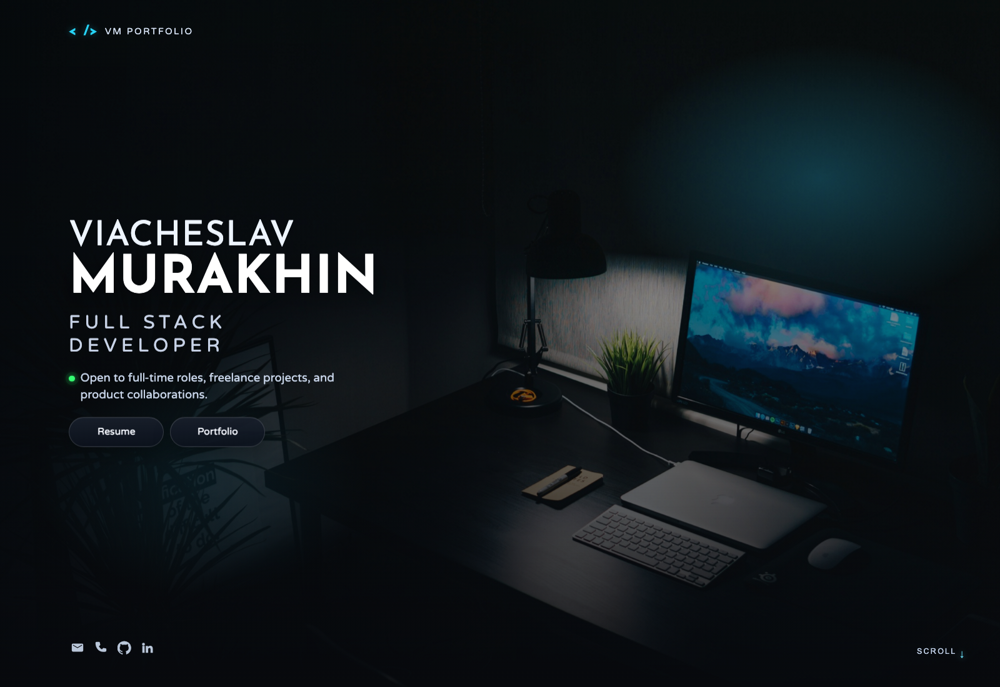
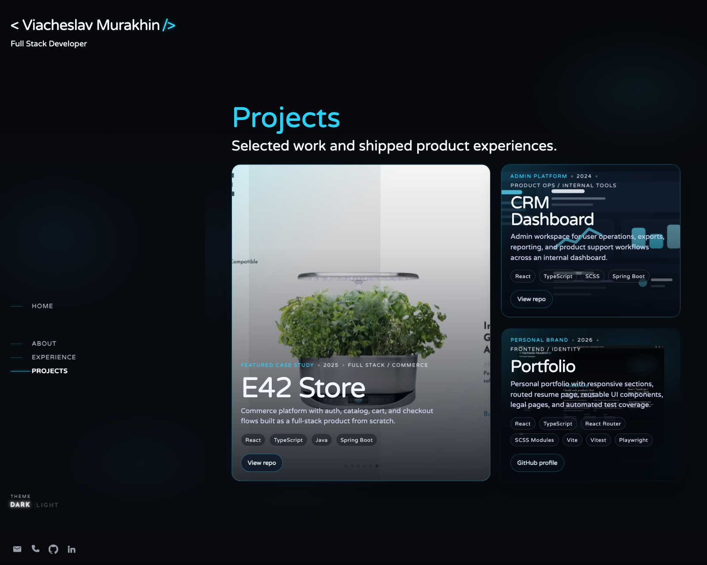
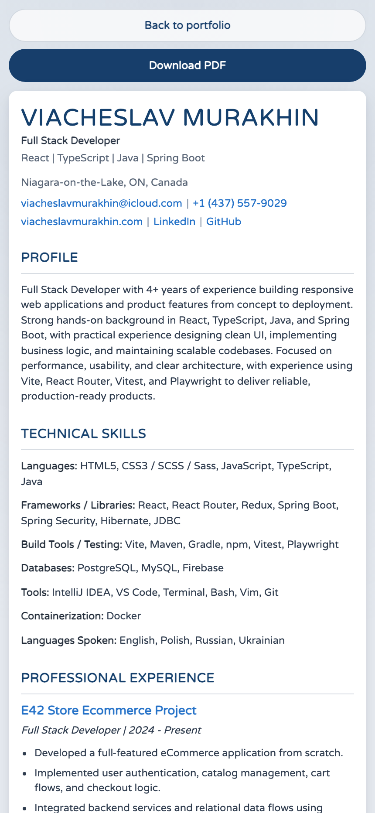

# Viacheslav Murakhin Portfolio

Production portfolio website for Viacheslav Murakhin built with React, TypeScript, Vite, SCSS Modules, Vitest, and Playwright.

This repository contains the public website, routed resume page, legal pages, responsive asset pipeline, and release documentation required to ship and maintain the project as a professional web property.

## Overview

| Area | Details |
| --- | --- |
| Product type | Personal portfolio and hiring website |
| Primary goal | Present experience, projects, resume, and contact paths in a polished, production-ready format |
| Runtime model | Single-page React app with client-side routing and deep-link support |
| Main audiences | Recruiters, hiring managers, collaborators, and clients |
| Visual modes | Dark and light themes with persisted theme preference |
| Release target | Static hosting with SPA rewrites and a custom domain |

## Highlights

- Centralized content model in `src/content/` to prevent copy drift between the homepage, footer, resume, and legal pages.
- Responsive image pipeline for hero photography and project previews.
- Route-aware metadata updates for titles, descriptions, canonical URLs, and social previews.
- Dedicated resume export flow that generates `public/documents/viacheslav-murakhin-resume.pdf`.
- Automated verification with Vitest and Playwright, including mobile route and navigation scenarios.

## Visual Preview

### Homepage



### Projects



### Resume on mobile



More screenshots:

- [Visual gallery](./docs/visual-gallery.md)

## Technology Stack

| Layer | Tools |
| --- | --- |
| UI | React 18, React Router 6 |
| Language | TypeScript |
| Build | Vite 7 |
| Styling | SCSS Modules, global SCSS tokens |
| Unit testing | Vitest, Testing Library, JSDOM |
| End-to-end testing | Playwright |
| Static hosting support | Vercel rewrites, Netlify `_redirects`, sitemap, robots, manifest |

## Quick Start

### Prerequisites

- Node.js 20+ recommended
- npm 10+ recommended

### Install

```bash
npm install
```

### Local development

```bash
npm run dev
```

Default local address:

```text
http://localhost:3000
```

### Optional Google Analytics 4 setup

1. Copy `.env.example` to `.env.local`.
2. Replace `G-XXXXXXXXXX` with your real GA4 Measurement ID.
3. Restart the Vite dev server after changing env values.

```bash
cp .env.example .env.local
```

### Production build

```bash
npm run build
```

Output directory:

```text
build/
```

### Preview the production build

```bash
npm run preview
```

Preview address:

```text
http://localhost:4173
```

## Scripts

| Command | Purpose |
| --- | --- |
| `npm run dev` | Start the local Vite development server |
| `npm start` | Alias for `npm run dev` |
| `npm run build` | Type-check and generate the production bundle in `build/` |
| `npm run preview` | Serve the production build locally |
| `npm test` | Run Vitest once |
| `npm run test:watch` | Run Vitest in watch mode |
| `npm run test:e2e` | Run Playwright end-to-end tests |
| `npm run test:e2e:install` | Install Chromium for Playwright |
| `npm run export:resume` | Build the app and export the resume PDF to `public/documents/` |

## Repository Map

| Path | Responsibility |
| --- | --- |
| `src/content/` | Central source of truth for profile data, SEO, navigation, legal copy, and project metadata |
| `src/components/` | Shared interface building blocks such as footer, sidebar, cards, and route metadata |
| `src/sections/` | Main one-page portfolio sections |
| `src/pages/` | Routed pages such as resume, privacy, copyright, and not found |
| `src/utils/` | Scroll helpers and shared utility logic |
| `src/constants/` | Navigation and route constants |
| `src/assets/` | Local fonts and image assets used by the app |
| `public/` | Static files copied directly into the production build |
| `scripts/` | Operational scripts such as resume PDF export |
| `docs/` | Project handbook for architecture, testing, mobile QA, deployment, and release operations |

## Runtime Behavior

- The app uses `BrowserRouter`, so direct links such as `/resume`, `/privacy`, and `/copyright` require SPA rewrites in production.
- Theme state is stored in `localStorage` and applied early in `index.html` to reduce flash during initial paint.
- Route metadata is updated at runtime from centralized route definitions.
- GA4 page views are sent on route changes only when `VITE_GA_MEASUREMENT_ID` is present.
- Main one-page sections keep the URL in sync while scrolling.

## Release Readiness

The project is prepared for static hosting and includes:

- `public/_redirects` for Netlify-style routing
- `vercel.json` for Vercel rewrites
- `public/robots.txt`
- `public/sitemap.xml`
- `public/manifest.json`
- `public/documents/viacheslav-murakhin-resume.pdf`

## Documentation

Start with the handbook index:

- [Documentation hub](./docs/README.md)
- [Architecture](./docs/architecture.md)
- [Content model](./docs/content-model.md)
- [Testing](./docs/testing.md)
- [Mobile matrix](./docs/mobile-matrix.md)
- [Deployment](./docs/deployment.md)
- [Legal and brand](./docs/legal-and-brand.md)
- [Release checklist](./docs/release-checklist.md)
- [Release notes template](./docs/release-notes-template.md)
- [Visual gallery](./docs/visual-gallery.md)
- [Roadmap](./docs/roadmap.md)

## Ownership and License

This repository is not published under an open-source license.

Unless a specific third-party dependency states otherwise:

- original source code is all rights reserved
- original written copy is all rights reserved
- original portfolio design and presentation are all rights reserved
- custom portfolio assets remain proprietary

See [COPYRIGHT.md](./COPYRIGHT.md) for the project notice.
