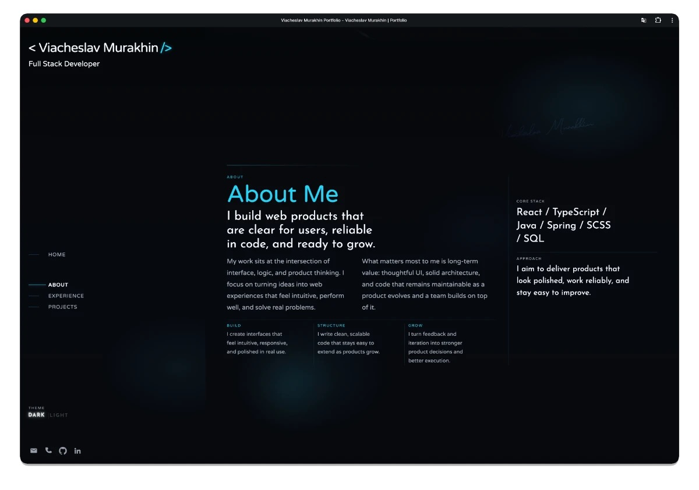

# Viacheslav Murakhin Portfolio

[](https://github.com/WenziLikes/Portfolio/actions/workflows/ci.yml)

[Live site](https://viacheslavmurakhin.com/) · [Projects](https://viacheslavmurakhin.com/projects) · [Resume](https://viacheslavmurakhin.com/resume) · [Documentation](./docs/README.md)



Production portfolio website for Viacheslav Murakhin built with React, TypeScript, Vite, React Router, SCSS Modules, Vitest, and Playwright.

The repository is structured as a real product rather than a one-off landing page. It includes a scroll-synced homepage shell, dedicated resume and legal pages, regional hiring landing pages, centralized content ownership, SEO metadata, automated tests, and a repeatable static-production build.

## Who This Repository Serves

- Recruiters and hiring managers who want a clear technical profile, direct resume access, and credible project evidence.
- Developers who need a maintainable React codebase with documented content ownership, routing, SEO, and release behavior.
- Release owners who need reproducible builds, static-hosting guidance, QA checkpoints, and production handoff notes.

## Product Snapshot

| Area | Details |
| --- | --- |
| Product type | Personal portfolio and hiring website |
| Runtime model | React 18 with `BrowserRouter`, build-time prerendering, and static route HTML output |
| Primary routes | `/`, `/about`, `/expertise`, `/experience`, `/projects`, `/resume`, `/privacy`, `/copyright` |
| Regional routes | `/canada`, `/usa`, `/europe` |
| Product routes | `/flipclock`, `/flipclock/support`, `/flipclock/privacy`, `/flipclock/terms` |
| Legacy redirect | `/home` redirects to `/` |
| Content model | Core content in `src/content/`, protected contact constants in `src/utils/contact.ts`, and FlipClock support/legal copy in `src/pages/flipclock/FlipClockPages.tsx` |
| UX behaviors | Scroll-synced section routing, desktop sidebar collapse, mobile menu, theme switching, draggable desktop project ordering |
| SEO model | Per-route metadata, prerendered HTML, sitemap, robots, structured data, and `hreflang` alternates for regional pages |
| Analytics | Optional GA4, loaded only after consent and only when `VITE_GA_MEASUREMENT_ID` is configured |
| Visitor chat | VMNorth chat widget loaded from `vmnorth.com`; its external runtime and privacy behavior are documented separately |
| Deployment target | Cloudflare Pages static hosting with route folders, `404.html`, manifest, sitemap, and downloadable resume PDF |

## Candidate Snapshot

| Category | Summary |
| --- | --- |
| Role focus | Full Stack Developer |
| Core stack | React, TypeScript, Java, Spring Boot |
| Supporting tools | Vite, React Router, SCSS Modules, Vitest, Playwright |
| Target work style | Remote product teams, startups, and software companies across Canada, the United States, and Europe |
| Languages | English, Polish, Russian, Ukrainian |
| Resume route | [viacheslavmurakhin.com/resume](https://viacheslavmurakhin.com/resume) |
| PDF resume | [Viacheslav-Murakhin-Resume.pdf](https://viacheslavmurakhin.com/documents/viacheslav-murakhin-resume.pdf) |

## What This Repository Demonstrates

- Production-minded frontend architecture instead of a static brochure page.
- Documented content ownership that keeps homepage copy, resume, website legal pages, product legal pages, footer, and SEO metadata aligned.
- Regional hiring landing pages that support Canada, USA, and Europe targeting without fragmenting the codebase.
- A shipped macOS product surface that connects the FlipClock Display portfolio case study, Mac App Store listing, support, privacy, and terms.
- Static deployment readiness with prerendered route HTML, `404.html`, manifest, sitemap, and legal/privacy coverage.
- Automated verification across unit tests, route tests, SEO tests, and Playwright browser coverage.

## Quick Start

### Prerequisites

- Node.js `^20.19.0` or `>=22.12.0`
- npm 10+

### Install dependencies

```bash
npm install
```

Use the lockfile-exact install for CI, release validation, or a clean checkout:

```bash
npm ci
```

### Start local development

```bash
npm run dev
```

Default local address:

```text
http://localhost:3000
```

### Optional Google Analytics setup

1. Copy `.env.example` to `.env.local`.
2. Set `VITE_GA_MEASUREMENT_ID` to the real GA4 Measurement ID, or leave it empty to keep analytics disabled.
3. Restart the dev server.

```bash
cp .env.example .env.local
```

`VITE_GA_MEASUREMENT_ID` is a public build-time value, not a secret. Changing it requires a rebuild and redeploy. It controls GA4 and its consent UI; it does not control the separately loaded VMNorth chat widget.

### Build for production

```bash
npm run build
```

Output directory:

```text
build/
```

### Preview the production build

```bash
npm run preview
```

Preview address:

```text
http://localhost:4173
```

## Validation and Release Commands

| Command | Purpose |
| --- | --- |
| `npm run dev` | Start the local Vite server |
| `npm run build` | Type-check, build the client, build the SSR entry, and prerender public routes into `build/` |
| `npm run preview` | Preview the production build locally |
| `npm test` | Run Vitest once |
| `npm run test:watch` | Run Vitest in watch mode |
| `npm run test:static` | Verify direct routes, metadata, a real `404`, hosting rules, and resume consistency in the existing `build/` |
| `npm run test:static:serve` | Serve the existing `build/` with production-like route, `_headers`, `_redirects`, and `404` behavior |
| `npm run test:e2e` | Build the site and run Playwright against the production-like static server |
| `npm run test:e2e:install` | Install Chromium for Playwright-based flows |
| `npm run export:resume` | Build, export `/resume` as PDF, and synchronize identical copies into `public/documents/` and `build/documents/` |
| `npm run docs:screenshots` | Refresh documentation screenshots in `docs/assets/` |

## Route Map

| Route | Role |
| --- | --- |
| [`/`](https://viacheslavmurakhin.com/) | Canonical portfolio landing route |
| [`/about`](https://viacheslavmurakhin.com/about), [`/expertise`](https://viacheslavmurakhin.com/expertise), [`/experience`](https://viacheslavmurakhin.com/experience), [`/projects`](https://viacheslavmurakhin.com/projects) | Deep links into the one-page portfolio shell |
| [`/resume`](https://viacheslavmurakhin.com/resume) | Dedicated resume page with browser download and installed-iOS Save/Share behavior |
| [`/privacy`](https://viacheslavmurakhin.com/privacy), [`/copyright`](https://viacheslavmurakhin.com/copyright) | Legal and production-trust pages |
| [`/canada`](https://viacheslavmurakhin.com/canada), [`/usa`](https://viacheslavmurakhin.com/usa), [`/europe`](https://viacheslavmurakhin.com/europe) | Regional hiring landing pages with market-specific copy and `hreflang` support |
| [`/flipclock`](https://viacheslavmurakhin.com/flipclock) | FlipClock Display product page with a direct Mac App Store download link |
| [`/flipclock/support`](https://viacheslavmurakhin.com/flipclock/support), [`/flipclock/privacy`](https://viacheslavmurakhin.com/flipclock/privacy), [`/flipclock/terms`](https://viacheslavmurakhin.com/flipclock/terms) | Product support and legal routes for FlipClock Display |
| `/home` | Legacy route that redirects to `/` |
| `*` | Not-found route rendered through the shared page shell |

## Repository Map

| Path | Responsibility |
| --- | --- |
| `src/content/site.ts` | Identity, navigation, about copy, expertise copy, resume data, website privacy/copyright copy, and base route metadata |
| `src/content/flipClock.ts` | Canonical FlipClock Display name, App Store URL, release metadata, and product route |
| `src/content/projects.ts` | Project cards, proof points, stacks, actions, and responsive image metadata |
| `src/content/marketPages.ts` | Canada, USA, and Europe landing-page copy plus regional route metadata |
| `src/components/` | Shared UI such as sidebar, footer, route metadata, consent banner, protected email links, and cards |
| `src/sections/` | Homepage sections mounted inside the main scrolling portfolio shell |
| `src/pages/` | Routed pages for resume, website legal content, FlipClock Display support/privacy/terms, regional landing pages, and not-found handling |
| `src/hooks/` | Shared media-query and scroll behavior hooks |
| `src/utils/` | Analytics, contact constants, scrolling helpers, and low-level helpers |
| `scripts/` | Prerendering, production-like static serving/smoke tests, resume export, and docs-screenshot automation |
| `public/` | Static assets copied into the build, including icons, manifest, robots, sitemap, and PDF resume |
| `docs/` | HR-facing overview, architecture, content model, testing, deployment, release, and handoff documentation |

## Documentation Paths

### For recruiters and HR

- [Hiring overview](./docs/hr-overview.md)
- [Visual gallery](./docs/visual-gallery.md)
- [Documentation hub](./docs/README.md)

### For developers and maintainers

- [Documentation hub](./docs/README.md)
- [Architecture](./docs/architecture.md)
- [Content model](./docs/content-model.md)
- [Testing](./docs/testing.md)
- [Production handoff](./docs/production-handoff.md)
- [Contributing](./.github/CONTRIBUTING.md)
- [Security policy](./SECURITY.md)

### For release owners

- [Deployment](./docs/deployment.md)
- [Release checklist](./docs/release-checklist.md)
- [Legal and brand](./docs/legal-and-brand.md)
- [Changelog](./CHANGELOG.md)
- [Release notes template](./docs/release-notes-template.md)

## Recommended Review Paths

### 3-minute recruiter review

1. Open the [live portfolio](https://viacheslavmurakhin.com/).
2. Review the [projects](https://viacheslavmurakhin.com/projects).
3. Open the [resume](https://viacheslavmurakhin.com/resume).
4. Skim the [hiring overview](./docs/hr-overview.md).

### Developer onboarding path

1. Read [Architecture](./docs/architecture.md).
2. Read [Content model](./docs/content-model.md).
3. Run `npm test` and `npm run build`.
4. Read [Production handoff](./docs/production-handoff.md).

### Pre-release path

1. Read [Deployment](./docs/deployment.md) and install from the lockfile with `npm ci`.
2. Install Playwright Chromium once with `npm run test:e2e:install`.
3. If resume copy changed, run `npm run export:resume`, then create the final artifact with `npm run build`.
4. Run `npm test`, `npm run test:static`, and `npm run test:e2e`.
5. Refresh docs screenshots if the UI changed materially.
6. Walk through the [release checklist](./docs/release-checklist.md).

## Production Deliverables

The deployable `build/` artifact contains:

- prerendered HTML for all public portfolio, resume, legal, and regional routes
- `404.html` for unknown routes
- `robots.txt` and `sitemap.xml`
- canonical, Open Graph, Twitter, and JSON-LD metadata
- `hreflang` alternate links for Canada, USA, Europe, and the default landing page
- manifest and icon assets
- downloadable resume PDF

Release-support artifacts remain in the repository and are not published inside `build/`:

- documentation screenshots in `docs/assets/`
- the visual gallery and release checklist
- the changelog and release-notes template

## Ownership and License

This repository is not published under an open-source license.

No license is granted to use, copy, modify, distribute, sublicense, or sell the original source code, copy, design, or portfolio assets unless the owner gives explicit written permission.

Unless a specific third-party dependency states otherwise:

- original source code is all rights reserved
- original written copy is all rights reserved
- original design and portfolio presentation are all rights reserved
- custom portfolio assets remain proprietary

See [COPYRIGHT.md](./COPYRIGHT.md) for the project notice.
