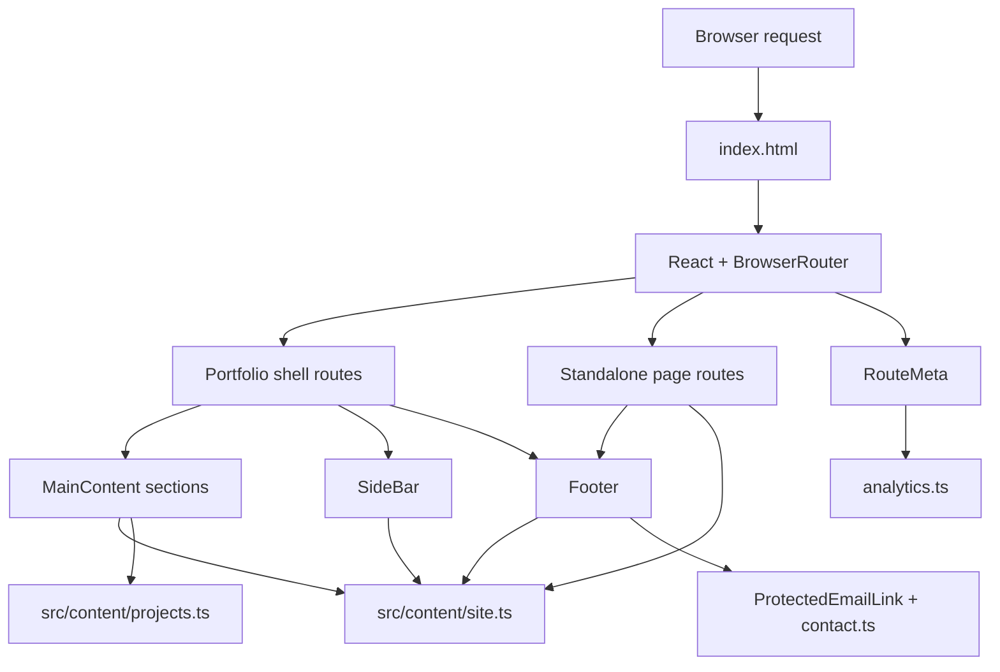

# Architecture

## Purpose

The project is a static-hosted React portfolio that combines:

- a one-page scrolling portfolio shell
- deep-linked section routes for the main portfolio flow
- dedicated routed pages for resume and legal content
- centralized content and contact helpers
- persisted UI state for theme, sidebar layout, and project ordering
- release-focused metadata, testing, and deployment support

## System View

## Route Model

| Route | Role |
| --- | --- |
| `/` | Default portfolio landing route |
| `/home` | Deep link to the home section |
| `/about` | Deep link to the about section |
| `/experience` | Deep link to the experience section |
| `/projects` | Deep link to the projects section |
| `/resume` | Dedicated resume page |
| `/privacy` | Privacy notice |
| `/copyright` | Copyright notice |
| `*` | Not found page |

### Why this matters

The app uses `BrowserRouter`, not hash routing. That keeps clean URLs, but it also means the production host must rewrite unknown paths back to `index.html`.

## Core Runtime Pieces

| File | Responsibility |
| --- | --- |
| `src/App.tsx` | Router setup, theme state, shell selection, and footer composition |
| `src/pages/MainContent.tsx` | One-page section assembly and section-to-route synchronization |
| `src/components/scrollToSection/ScrollToSection.tsx` | Scroll restoration and deep-link entry into the correct section |
| `src/components/sideBar/SideBar.tsx` | Desktop navigation, theme controls, sidebar collapse, and mobile navigation |
| `src/sections/projects/Projects.tsx` | Featured project layout, drag-and-drop ordering, and order persistence |
| `src/components/footer/Footer.tsx` | Shared footer, resume download CTA, contact CTA, and legal links |
| `src/components/protectedEmailLink/ProtectedEmailLink.tsx` | Email link rendering backed by protected contact constants |
| `src/components/routeMeta/RouteMeta.tsx` | Runtime updates for title, description, canonical URL, and social metadata |
| `src/utils/analytics.ts` | Optional GA4 initialization and event tracking helpers |

## Content Architecture

The project intentionally keeps human-facing content out of scattered UI files.

| Source file | Owns |
| --- | --- |
| `src/content/site.ts` | Profile identity, navigation labels, about copy, experience, resume content, legal copy, route metadata, and footer information |
| `src/content/projects.ts` | Project order, titles, descriptions, actions, stack labels, and image metadata |
| `src/utils/contact.ts` | Public email constants used by protected email links |

This prevents copy drift between:

- homepage sections
- sidebar
- footer
- resume page
- legal pages
- metadata

## Section Composition

The portfolio shell always mounts the following sequence:

1. `Home`
2. `About`
3. `Experience`
4. `Projects`

Each section lives inside the same scroll container. `MainContent.tsx` uses `IntersectionObserver` so the URL updates as the user scrolls between sections.

The `Projects` section has two live behaviors worth documenting:

- the first card is treated as the featured project on desktop
- desktop drag-and-drop can reorder cards and persist a custom order locally

## Persisted UI State

| State | Storage | Owner |
| --- | --- | --- |
| Active theme (`dark` / `light`) | `localStorage["theme"]` | `src/App.tsx` |
| Desktop sidebar collapsed state | `localStorage["portfolio-sidebar-collapsed"]` | `src/components/sideBar/SideBar.tsx` |
| Custom project order | `localStorage["vm-projects-order"]` and `localStorage["vm-projects-order-customized"]` | `src/sections/projects/Projects.tsx` |

These states are intentionally local-only. No server-side session or account storage exists.

## Styling Strategy

| Scope | Location |
| --- | --- |
| Global tokens, layout, background, type system | `src/index.scss` |
| Section-level layout styling | `src/sections/sections.module.scss` |
| Component-level styling | `*.module.scss` beside the component |

Rules used by the project:

- SCSS files are the source of truth
- generated CSS artifacts are not stored in `src/`
- component styles stay colocated with the component

## Asset Strategy

### App assets

- Local hero graphic and local font assets
- Local JPG, SVG, PNG, and WebP project previews
- Local icons, manifest assets, and resume PDF in `public/`
- Documentation screenshots in `docs/assets/`

### Why local assets are preferred

- no hotlinked media dependencies
- predictable performance
- clear ownership over portfolio visuals
- fewer licensing ambiguities

## Metadata and SEO

The project uses three metadata layers:

| Layer | Purpose |
| --- | --- |
| `index.html` | Base metadata, structured data, manifest links, favicon, and theme bootstrap |
| `src/content/site.ts` | Canonical site metadata and per-route meta definitions |
| `RouteMeta.tsx` | Runtime updates for title, description, canonical URL, and social tags |

## Operational Extensions

The codebase includes release-facing operational workflows:

- release documentation in `docs/`
- automated tests with Vitest and Playwright
- SPA rewrite configuration for multiple hosts
- PDF resume export
- reproducible documentation screenshot refresh via `npm run docs:screenshots`
