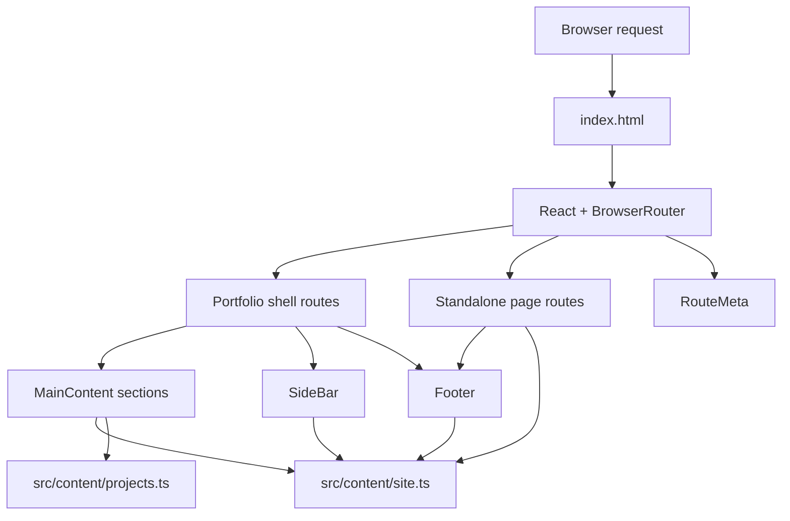

# Architecture

## Purpose

The project is a static-hosted React portfolio that combines:

- a one-page scrolling portfolio shell
- dedicated routed pages for resume and legal content
- a centralized content layer
- release-focused metadata, testing, and deployment support

## System View

## Route Model

| Route | Role |
| --- | --- |
| `/` | Default portfolio landing route |
| `/home` | Deep link to the home section |
| `/about` | Deep link to the about section |
| `/experience` | Deep link to the experience section |
| `/projects` | Deep link to the projects section |
| `/resume` | Dedicated resume page |
| `/privacy` | Privacy notice |
| `/copyright` | Copyright notice |
| `*` | Not found page |

### Why this matters

The app uses `BrowserRouter`, not hash routing. That keeps clean URLs, but it also means the production host must rewrite unknown paths back to `index.html`.

## Core Runtime Pieces

| File | Responsibility |
| --- | --- |
| `src/App.tsx` | Router setup, theme state, shell selection, footer composition |
| `src/pages/MainContent.tsx` | One-page section assembly and section-to-route synchronization |
| `src/components/scrollToSection/ScrollToSection.tsx` | Scroll restoration and deep-link entry into the correct section |
| `src/components/sideBar/SideBar.tsx` | Primary navigation, theme controls, and compact/mobile navigation entry |
| `src/components/footer/Footer.tsx` | Shared footer, contact CTA, legal links, and release-facing contact copy |
| `src/components/routeMeta/RouteMeta.tsx` | Runtime updates for title, description, canonical URL, and social metadata |

## Content Architecture

The project intentionally keeps human-facing content out of scattered UI files.

| Source file | Owns |
| --- | --- |
| `src/content/site.ts` | Profile identity, navigation labels, about copy, experience, resume content, legal copy, route metadata, footer information |
| `src/content/projects.ts` | Project order, titles, descriptions, actions, stack labels, and image metadata |

This prevents copy drift between:

- homepage sections
- sidebar
- footer
- resume page
- legal pages
- metadata

## Section Composition

The portfolio shell renders the following sequence:

1. `Home`
2. `About`
3. `Experience`
4. `Projects`

Each section is mounted in the main content flow and observed with `IntersectionObserver` so the URL updates while the user scrolls.

## Theme Model

Theme behavior is split across two layers:

| Layer | Responsibility |
| --- | --- |
| `index.html` bootstrap script | Apply theme early and reduce flash during initial paint |
| `App.tsx` | Persist theme, update browser chrome values, and keep the active theme in sync with the DOM |

Theme state is stored in `localStorage` and supports:

- `dark`
- `light`

## Styling Strategy

| Scope | Location |
| --- | --- |
| Global tokens, layout, background, type system | `src/index.scss` |
| Section-level layout styling | `src/sections/sections.module.scss` |
| Component-level styling | `*.module.scss` beside the component |

Rules used by the project:

- SCSS files are the source of truth
- generated CSS artifacts are not stored in `src/`
- component styles stay colocated with the component

## Asset Strategy

### App assets

- Local hero photography for responsive first-screen rendering
- Local JPG, SVG, and WebP project previews
- Local icons, manifest assets, and resume PDF in `public/`

### Why local assets are preferred

- no hotlinked media dependencies
- predictable performance
- clear ownership over portfolio visuals
- fewer licensing ambiguities

## Metadata and SEO

The project uses two layers of metadata:

| Layer | Purpose |
| --- | --- |
| `index.html` | Base metadata, structured data, canonical baseline, manifest, favicon, theme bootstrap |
| `RouteMeta.tsx` + route definitions | Per-route title, description, canonical updates, and social tag refresh |

## Operational Extensions

The codebase already includes hooks for production operations:

- release documentation in `docs/`
- automated tests
- SPA rewrite configuration for multiple hosts
- PDF resume export

That makes the repository more than a visual site. It behaves like a maintained product surface.
