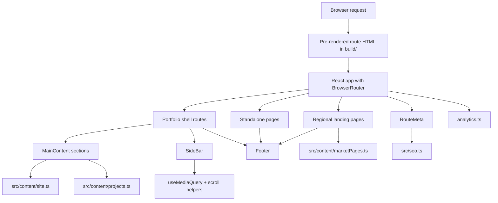

# Architecture

## Purpose

The project is a static-hosted React portfolio that combines:

- a one-page scrolling portfolio shell
- deep-linked section routes for the main portfolio flow
- dedicated routed pages for resume and legal content
- regional hiring landing pages for Canada, USA, and Europe
- build-time prerendering for crawlable route HTML
- centralized content and SEO inputs
- persisted browser-only UI state
- automated validation for layout, routing, metadata, and release behavior

## System View

## Route Model

| Route | Role |
| --- | --- |
| `/` | Canonical landing route for the scrolling portfolio shell |
| `/home` | Legacy route that redirects to `/` |
| `/about` | Deep link to the about section |
| `/expertise` | Deep link to the expertise section |
| `/experience` | Deep link to the experience section |
| `/projects` | Deep link to the projects section |
| `/resume` | Dedicated resume page |
| `/privacy` | Privacy notice |
| `/copyright` | Copyright notice |
| `/canada` | Regional hiring page for Canadian teams |
| `/usa` | Regional hiring page for US teams |
| `/europe` | Regional hiring page for Europe and default English `hreflang` targeting |
| `*` | Not-found route rendered through the shared page shell |

### Why this matters

The app uses `BrowserRouter`, but production does not rely on a generic SPA catch-all rewrite. The build pipeline prerenders all known public routes into static HTML and also writes a real `404.html`, which keeps direct links, SEO, and static-hosting compatibility aligned.

## Core Runtime Pieces

| File | Responsibility |
| --- | --- |
| `src/App.tsx` | Router setup, theme state, analytics consent state, shell selection, and shared page-shell composition |
| `src/pages/MainContent.tsx` | Mounts the homepage sections, keeps them in one scroll container, and syncs the URL with scroll position |
| `src/components/scrollToSection/ScrollToSection.tsx` | Scroll restoration and deep-link entry into the correct homepage section |
| `src/components/sideBar/SideBar.tsx` | Desktop navigation, mobile navigation, theme controls, sidebar collapse behavior, and section highlighting |
| `src/pages/market/MarketLandingPage.tsx` | Regional landing page UI for Canada, USA, and Europe |
| `src/pages/resume/Resume.tsx` | Resume page, contact block, and PDF download entry point |
| `src/pages/legal/LegalDocumentPage.tsx` | Shared legal-page layout used by privacy and copyright routes |
| `src/components/footer/Footer.tsx` | Shared footer, resume CTA, legal links, regional links, and contact entry points |
| `src/components/routeMeta/RouteMeta.tsx` | Runtime updates for title, description, canonical URL, robots, structured data, and alternate links |
| `src/seo.ts` | Shared SEO metadata, structured data generation, robots, sitemap, and route-indexability helpers |
| `src/entry-server.tsx` | SSR entry used only during build-time prerendering |
| `scripts/prerender.mjs` | Generates route HTML, `/home` redirect HTML, `404.html`, `robots.txt`, and `sitemap.xml` after the build |
| `scripts/export-resume.mjs` | Builds the app, serves `build/` locally, and exports the `/resume` route as PDF using Playwright |

## Homepage Shell Composition

The portfolio shell always mounts the following sequence inside the same scroll container:

1. `Home`
2. `About`
3. `Expertise`
4. `Experience`
5. `Projects`

`MainContent.tsx` uses `IntersectionObserver` to determine which section is currently dominant in view and replaces the URL with the matching route. This keeps the homepage feeling like one continuous product surface while preserving section-level deep links.

## Content Architecture

The project intentionally keeps human-facing copy out of scattered UI files.

| Source file | Owns |
| --- | --- |
| `src/content/site.ts` | Identity, navigation labels, target markets, about copy, expertise copy, experience timeline, resume content, legal copy, and route metadata |
| `src/content/projects.ts` | Project order, titles, descriptions, proof points, stack labels, actions, and responsive image metadata |
| `src/content/marketPages.ts` | Regional landing-page content, market-specific claims, `hreflang` alternates, and regional route metadata |
| `src/utils/contact.ts` | Public email constants used by protected email link rendering |

This structure prevents copy drift across:

- homepage sections
- sidebar and footer
- routed resume page
- legal pages
- regional landing pages
- SEO metadata and structured data

## Persisted Browser State

| State | Storage | Owner |
| --- | --- | --- |
| Active theme (`dark` / `light`) | `localStorage["theme"]` | `src/App.tsx` |
| Desktop sidebar collapsed state | `localStorage["portfolio-sidebar-collapsed"]` | `src/components/sideBar/SideBar.tsx` |
| Custom project order | `localStorage["vm-projects-order"]` and `localStorage["vm-projects-order-customized"]` | `src/sections/projects/Projects.tsx` |
| Analytics consent | `localStorage["vm-analytics-consent"]` | `src/App.tsx` and `src/utils/analytics.ts` |

These states are deliberately browser-local. There is no account system and no remote persistence layer.

## Styling Strategy

| Scope | Location |
| --- | --- |
| Global tokens, typography, backgrounds, and shell sizing | `src/index.scss` |
| Section-level layout styling | `src/sections/sections.module.scss` |
| Component-level styling | colocated `*.module.scss` files |
| Shared document-page mixins | `src/styles/_documentPage.scss` |

Rules used by the project:

- SCSS Modules are the source of truth for component and page styling.
- Repeated document-page patterns are extracted into shared mixins instead of duplicated between resume, legal, and regional pages.
- Media-query logic is centralized through `useMediaQuery` where responsive runtime behavior is shared.

## SEO and Metadata

The project uses three coordinated metadata layers:

| Layer | Purpose |
| --- | --- |
| `index.html` | Base metadata, theme bootstrap, manifest links, and structured data placeholders |
| `src/content/site.ts` and `src/content/marketPages.ts` | Canonical site metadata plus per-route titles, descriptions, keywords, and regional alternates |
| `src/seo.ts` | Route resolution, robots handling, sitemap generation, structured data, and `hreflang` support |

`src/seo.ts` also models:

- indexable vs non-indexable routes
- sitemap priorities and change frequencies
- professional audience, language, and market targeting
- organization, person, website, breadcrumb, and page schemas
- regional alternate links for Canada, USA, Europe, and the default route

## Operational Notes

Important release-facing behaviors:

- Google Analytics is optional and activates only when a measurement ID is configured and the visitor grants consent.
- The resume PDF is a generated artifact and must be refreshed after resume copy changes.
- Documentation screenshots are release artifacts and should be refreshed after meaningful UI changes.
- Static hosting must serve generated route HTML from `build/`, keep `/home` redirect output intact, and return `404.html` for unknown paths.
