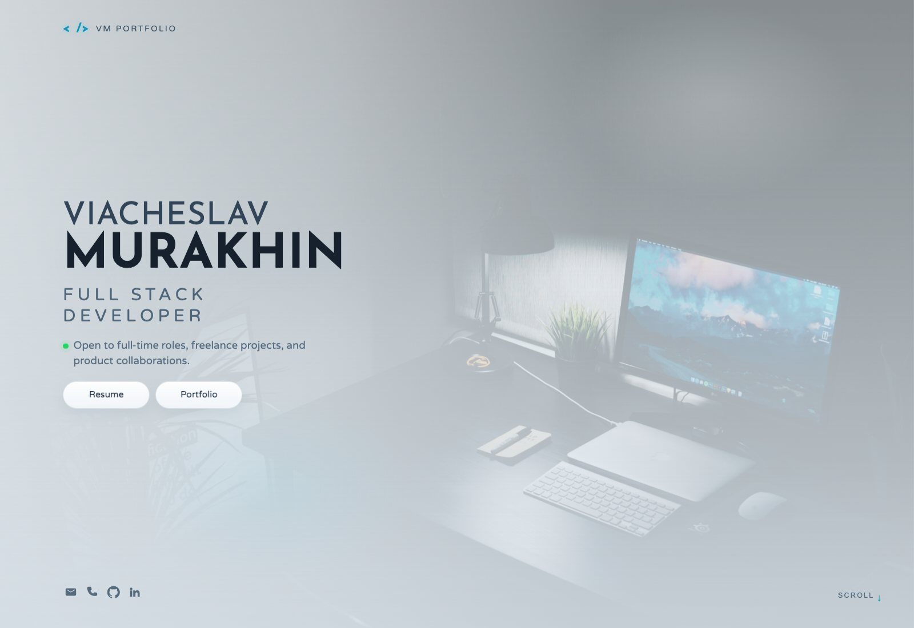
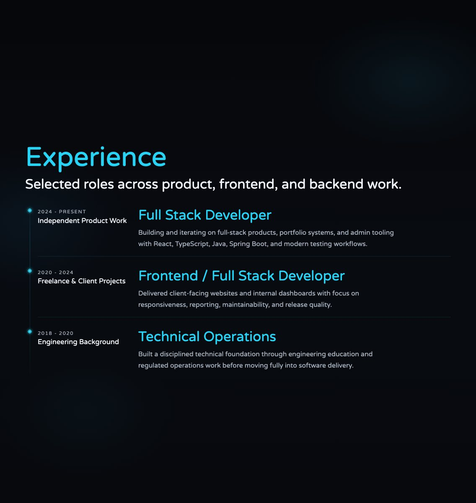
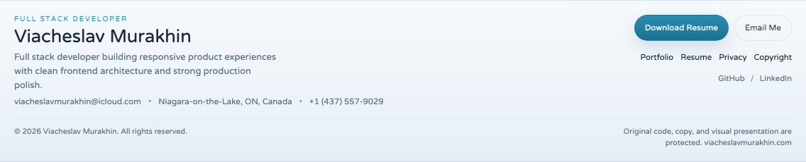
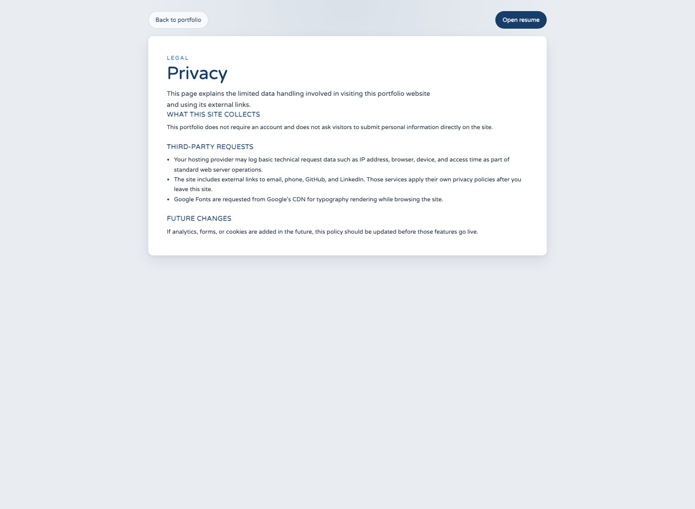
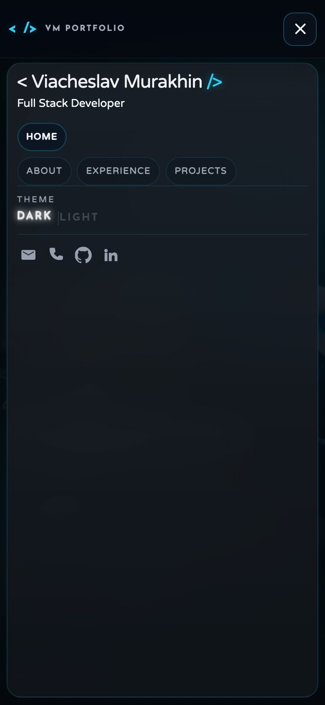
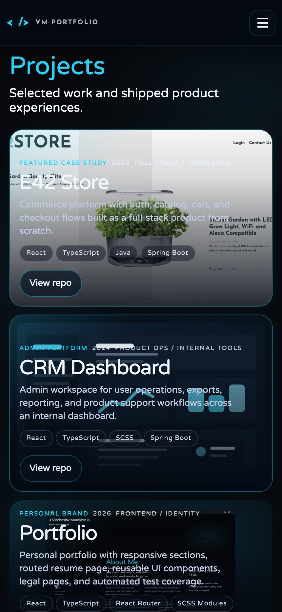

# Visual Gallery

This gallery documents the current visual state of the portfolio across desktop, mobile, theme, content, and legal surfaces.

Use it for:

- release reviews
- documentation handoff
- design comparisons
- content verification

## Desktop

### Homepage hero, dark theme

### Homepage hero, light theme

### Experience section

### Projects section

### Footer, light theme

### Privacy page

## Mobile

### Resume page

### Mobile menu open

### Projects on mobile

## Maintenance Note

If the visual system changes materially, refresh this gallery before the next release so the documentation remains aligned with the live product.
