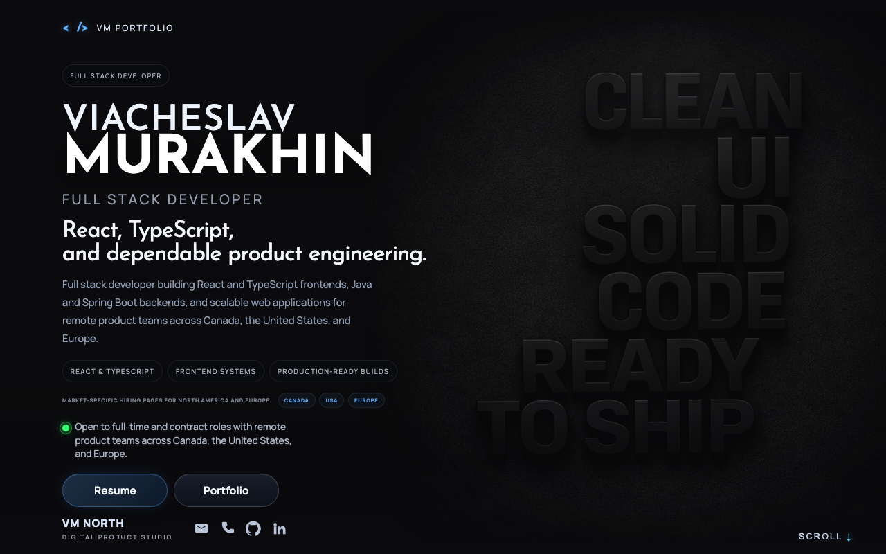
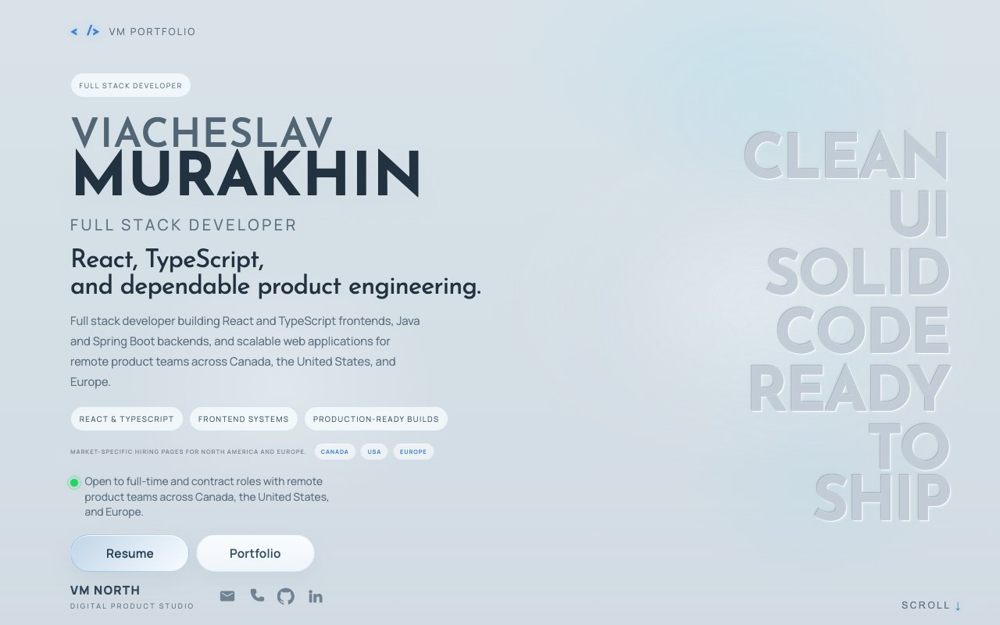
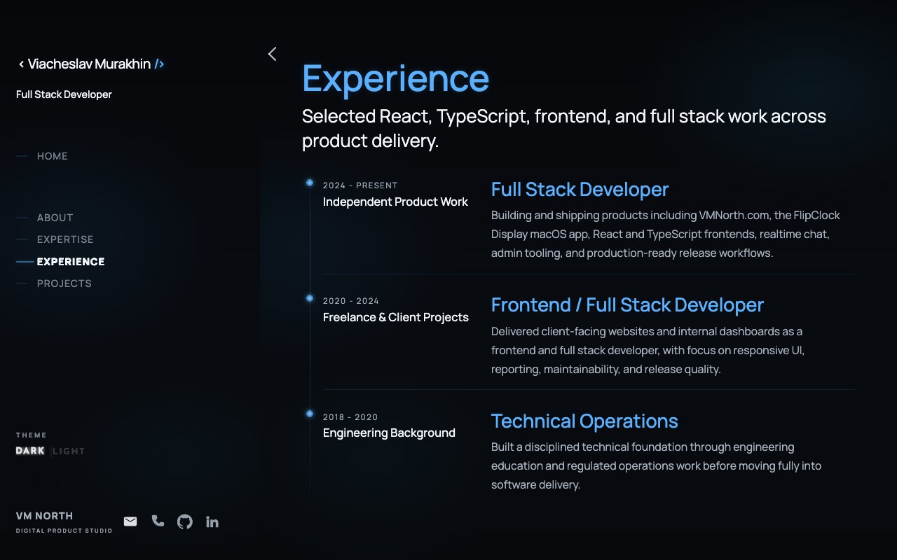
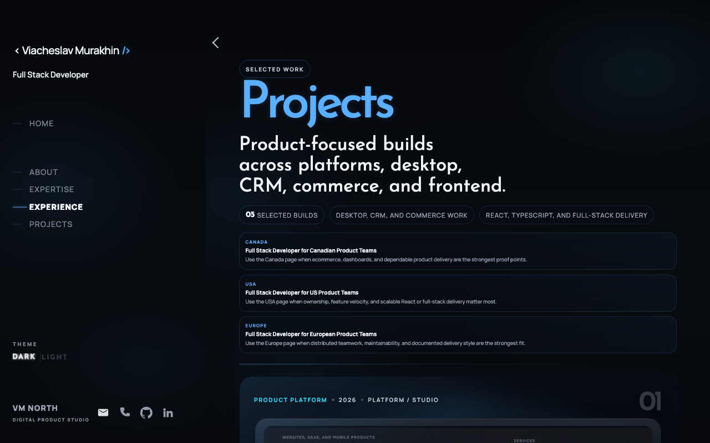
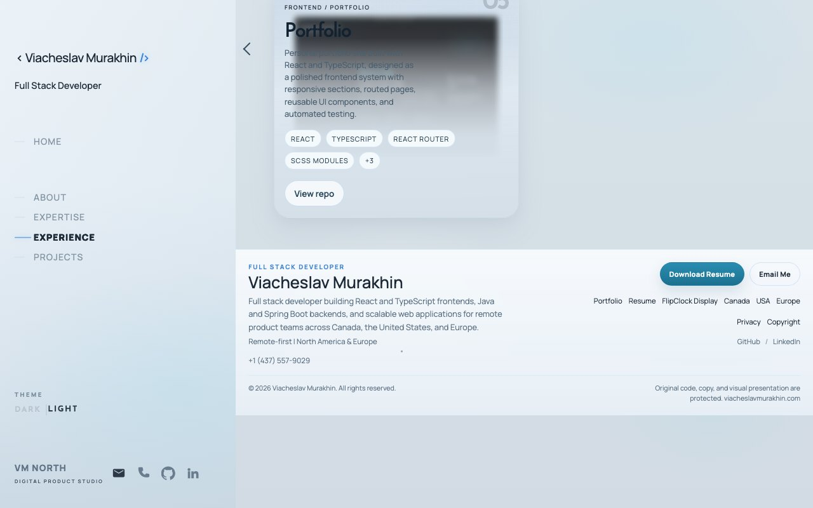
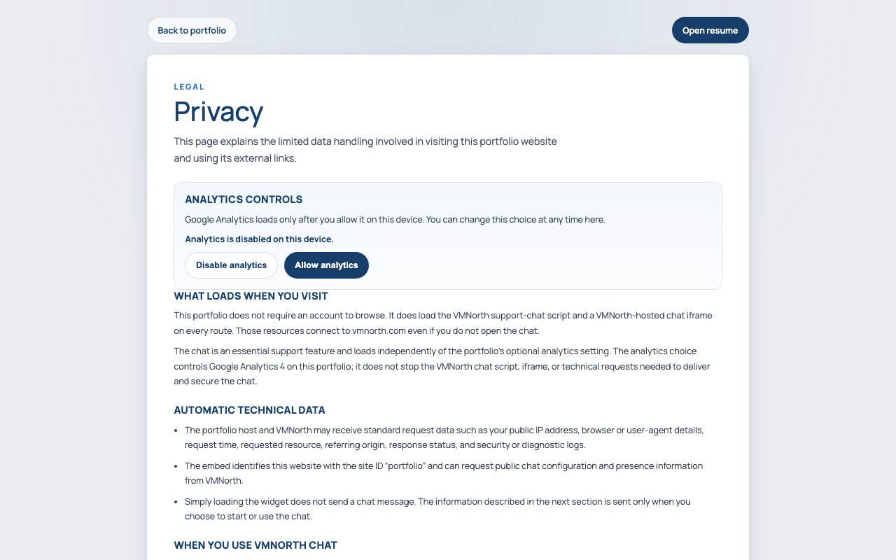
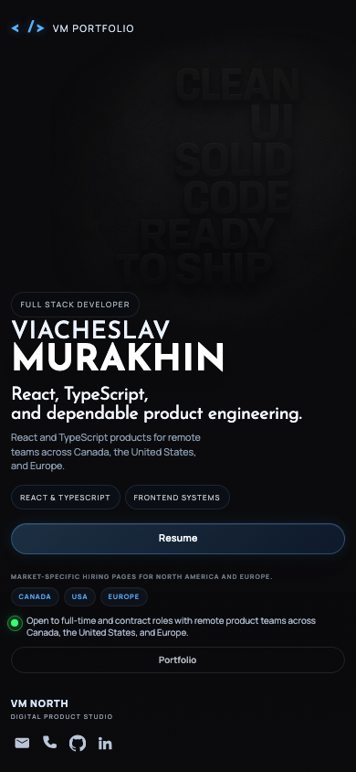
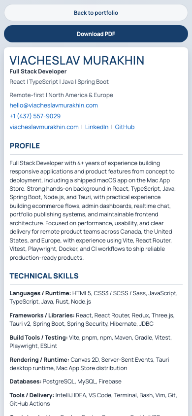
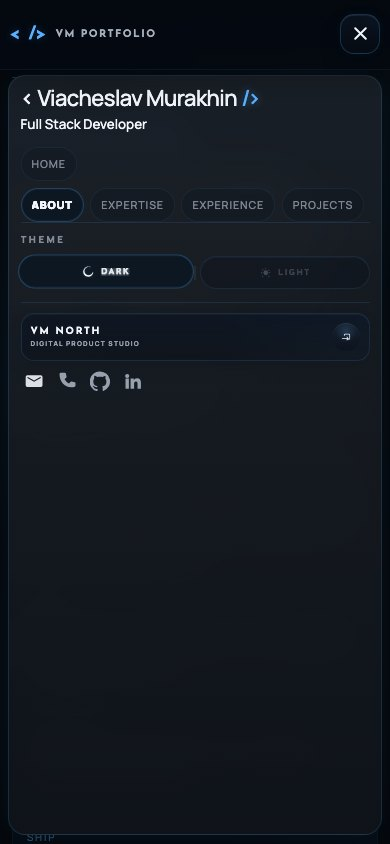
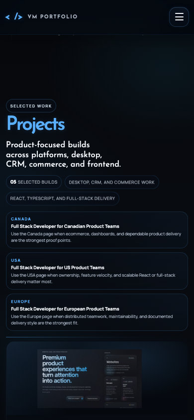

# Visual Gallery

[← Back to documentation hub](./README.md)

This gallery contains dated repository snapshots across desktop, mobile, theme, content, and legal surfaces. The images support release review and visual comparison; they are not continuous proof of the currently deployed site's state.

Use it for:

- release reviews
- documentation handoff
- design comparisons
- content verification

## Refresh Metadata

| Field | Value |
| --- | --- |
| Last refreshed | 2026-08-31 |
| Source state | Current working tree based on commit [`5708b2e`](https://github.com/WenziLikes/Portfolio/commit/5708b2e); update this reference after the changes are committed if desired |
| Capture command | `npm run docs:screenshots` |
| Desktop viewport | 1280 × 800 |
| Mobile viewport | 390 × 844 |
| Capture controls | Explicit light/dark theme, analytics consent set to denied, animations disabled, and the external VM North chat script blocked by the screenshot runner |
| Artifact scope | Release-support files in `docs/assets/`; they are not copied into the production `build/` by default |

A screenshot describes the working tree captured on the date above. If code, copy, viewport rules, or assets change afterward, treat the image as historical until the gallery is refreshed again.

## Desktop

### Homepage hero, dark theme

### Homepage hero, light theme

### Experience section

### Projects section

### Footer, light theme

### Privacy page

## Mobile

### Homepage hero

### Resume page

### Mobile menu open

### Projects on mobile

## Maintenance

Run `npm run docs:screenshots` after a material visual change, review every generated image, and update the refresh date and source reference above. Commit the reviewed images with the UI change or release-preparation update that required them.
